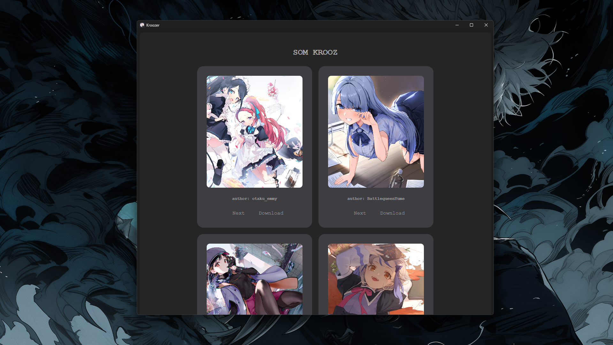

<h1>Anime DashBoard</h1>

  This application uses electron and react to render images from an api
  the images can be downloaded and saved in the disk and also you can
  fetch images individually by clicking on the "next" button on each card
  element or you can click on "new data" button to fetch new images for all 
  at once.

 

This project is mainly have been created to learn the fundamentals of electron and react! :-}</p1>

## License
MIT © [Electron React Boilerplate](https://github.com/electron-react-boilerplate)